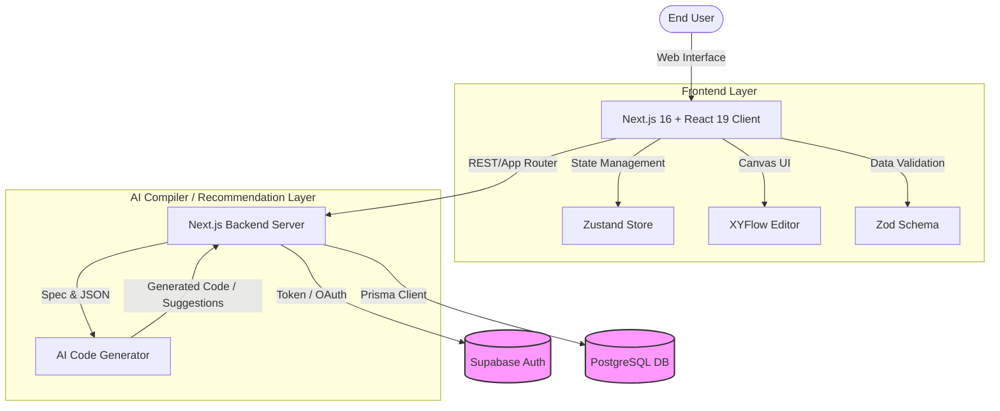
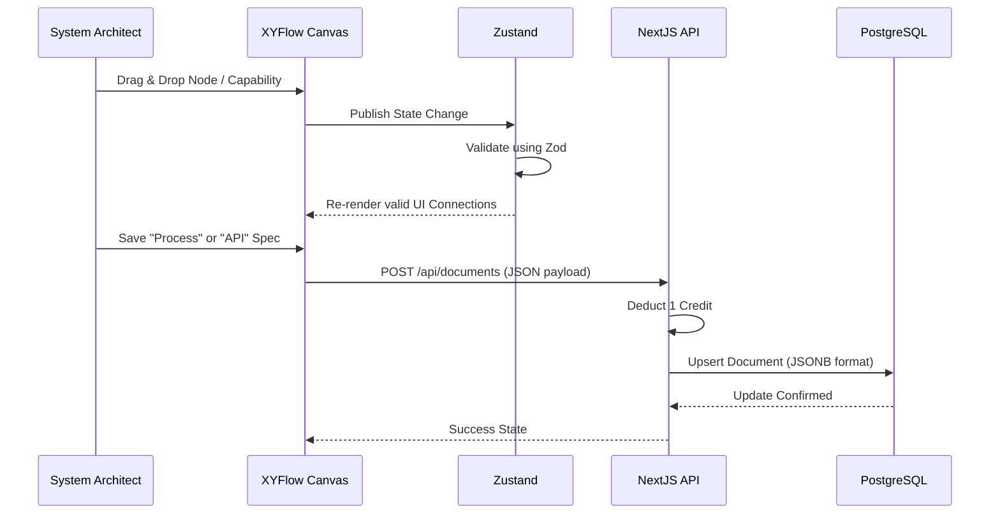
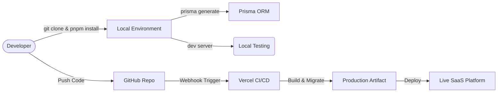
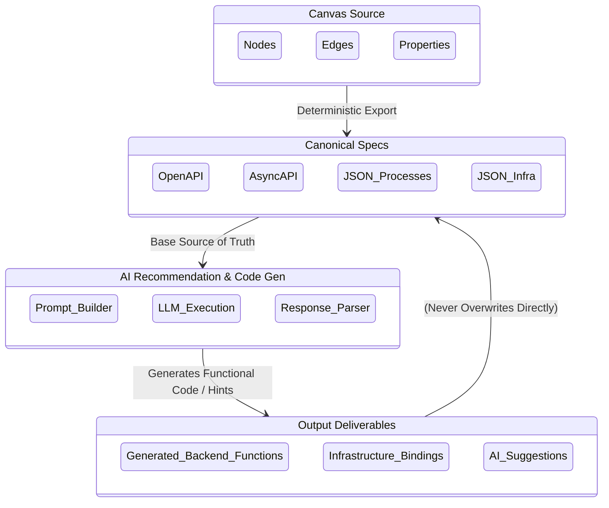
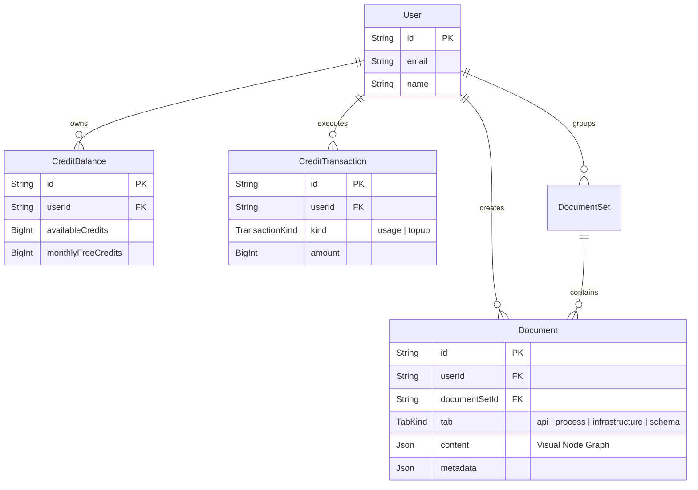
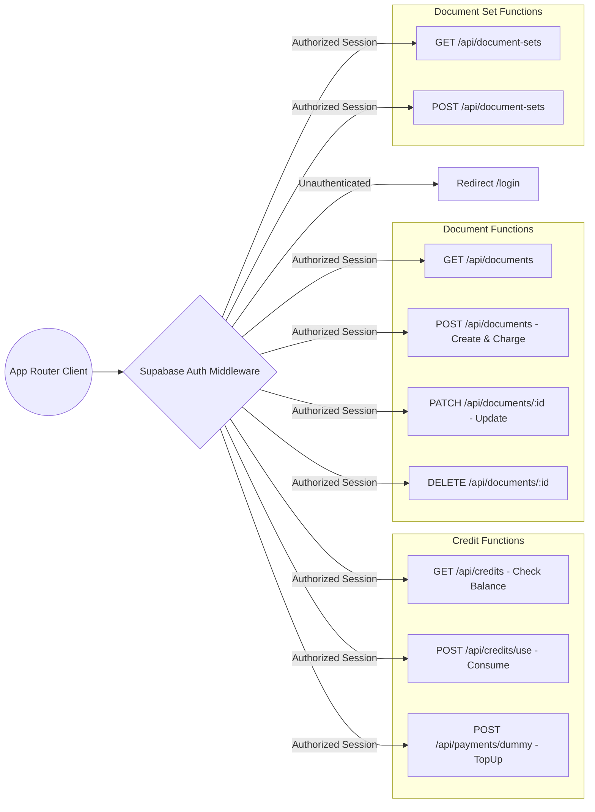

# Ermiz Studio Architecture

## 1. High-Level System Architecture

## 2. User Data Flow & Interactions

## 3. Developer / CI-CD Flow

## 4. AI Recommendation & Compiler Flow

## 5. Database ER Diagram

## 6. Functional Endpoints Data Architecture

